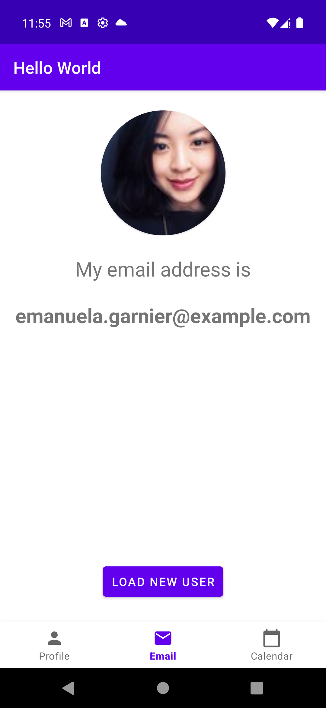
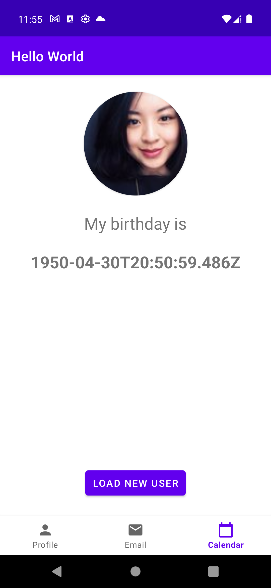

# Prueba técnica Luis Ramírez

La aplicación consume el siguiente servicio: https://randomuser.me/api

El servicio anterior devolverá un usuario random cada vez que se ejecute. Esta información se muestra en 3 secciones:

nombre 
 
correo
 
fecha de nacimiento  

Cuenta con un botón que actualiza el usuario.

